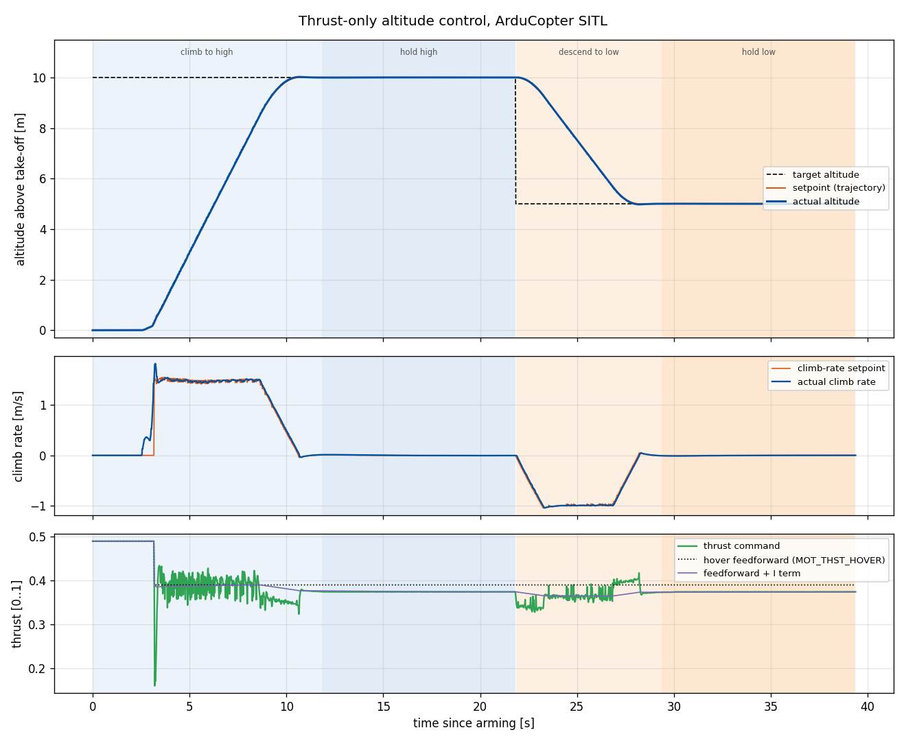

# ArduCopter SITL: thrust-only altitude PID

A C++ program that controls the altitude of an ArduCopter in SITL using thrust commands only. It:

1. Switches to GUIDED mode.
2. Arms the copter. Arming directly in GUIDED lets the thrust stream start right away, before ArduPilot's auto-disarm can trigger.
3. Climbs to 10 m and holds.
4. Descends to 5 m and holds.
5. Switches to LAND.

- **Control:** a cascaded PID controller calculates the thrust. The program sends it to ArduPilot 50 times per second in `SET_ATTITUDE_TARGET` messages, with the attitude kept level. With `GUID_OPTIONS=8`, ArduPilot applies this value directly as motor thrust.
- **Stack:** C++17, MAVSDK v4, CMake, GoogleTest. Python only for plots and SITL test scripts.
- **Result:** overshoot ≈ 0.02 m, hold error ≤ 6 mm in SITL.

## Quick start

Requirements: Xcode Command Line Tools and Homebrew (macOS), Python 3.10+, CMake 3.20+.

```bash
brew install cmake
git clone --recurse-submodules --shallow-submodules --depth 1 https://github.com/ArduPilot/ardupilot.git ardupilot
python3 -m venv .venv && .venv/bin/pip install -r requirements.txt
source .venv/bin/activate
(cd ardupilot && ./waf configure --board sitl && ./waf copter)   # SITL, ~2 min
scripts/build_mavsdk.sh                                          # MAVSDK into third_party/, ~10 min
cmake -S . -B build && cmake --build build -j && (cd build && ctest)
```

Run:

```bash
scripts/run_sitl.sh --wipe             # SITL: UDP 14550 (ground station), 14551 (controller)
./build/altitude_control               # mission; settings in config/mission.conf, log in logs/flight.csv
python scripts/plot.py logs/flight.csv # plot: altitude, climb rate, thrust
```

Other tools:
- `altitude_control --set key=value` overrides any config value.
- `--run telemetry` and `--run open-loop` are bring-up checks.
- `scripts/tune.py` runs gain sweeps; `scripts/flight_metrics.py` computes step-response metrics.
- `scripts/fault_tests.py` runs fault injection.

## How it works

On every control tick (50 Hz) the program:

1. Reads altitude and climb rate from `LOCAL_POSITION_NED`.
2. Moves the altitude setpoint toward the target along a smooth trajectory, limited in speed and acceleration.
3. **Outer loop (P):** converts the altitude error into a climb-rate setpoint.
4. **Inner loop (PID):** converts the climb-rate error into a thrust correction.
5. Sends `MOT_THST_HOVER` plus the correction as the thrust value.

| Component | Role |
|---|---|
| `DroneInterface` | MAVSDK: telemetry, parameters, mode, arming, thrust commands |
| `AltitudeController` | take-off phase + cascade above |
| `PIDController` | derivative on measurement, filtered D, anti-windup, output limits |
| `MissionRunner` | state machine, 50 Hz control loop, safety checks |
| `DataLogger` | per-tick CSV log |

**Take-off:** until the copter is 0.3 m above the ground, thrust is fixed at hover + 0.10, with the PID held in reset. The cascade then takes over from the current altitude and speed.

**Safety:** any of these triggers LAND:
- telemetry older than 0.2 s, or a loop stall over 0.5 s
- an unexpected disarm
- altitude above 15 m
- a state timeout (60 s)
- Ctrl+C

If someone else changes the flight mode, the controller stops and leaves the vehicle to them. It refuses to start on an armed vehicle.

Exit codes: 0 done, 1 error, 3 released to the operator, 130 interrupted.

## Results

Final run from wiped SITL parameters (`docs/`):



| | Climb to 10 m | Descend to 5 m |
|---|---|---|
| Overshoot | 0.020 m | 0.024 m |
| Settling (±0.10 m) | 10.1 s after arming (incl. ~3 s spool-up) | 5.8 s |
| Hold error, RMS / max | 0.003 / 0.006 m | 0.002 / 0.005 m |

**Gains** (tuned in SITL, inner loop first):
- `vel_kp` 0.7: a limit cycle starts at about 2.0.
- `vel_ki` 0.15.
- `vel_kd` 0: D only increased overshoot.
- `alt_kp` 2.0.

## Design notes

Based on SITL experiments (`scripts/risk_tests.py`) and the ArduCopter source.

- **Altitude:** `alt = -LOCAL_POSITION_NED.z` (NED is z-down).
- **`type_mask = 7`:** ignores all body rates. ArduPilot rejects a mask that ignores only some of them.
- **Command stream gaps are dangerous:** ArduPilot keeps applying the last thrust until `GUID_TIMEOUT` (set to 1 s), then holds altitude. That's why there is one loop sending fresh thrust every tick.
- **`MOT_THST_HOVER`** is only a feedforward. The integrator absorbs the error.
- **Trapezoidal setpoint trajectory:** a plain ramp overshot by about 0.5 m.
- **Explicit streams:** SITL's SERIAL1 streams nothing by default, so the controller requests every message it uses. There's no MAVProxy router, because it overrode those rates.
- **MAVSDK v4:** `MavlinkPassthrough` is deprecated, so `MavlinkDirect` sends `SET_ATTITUDE_TARGET` and `DO_SET_MODE`.

## Limitations

- **Tuned in noise-free SITL.** Real hardware needs lower gains and more filtering.
- **Altitude only.** Horizontal drift is not corrected.
- **Project paths containing spaces break `sim_vehicle.py`**, so `scripts/run_sitl.sh` starts `arducopter` directly.
